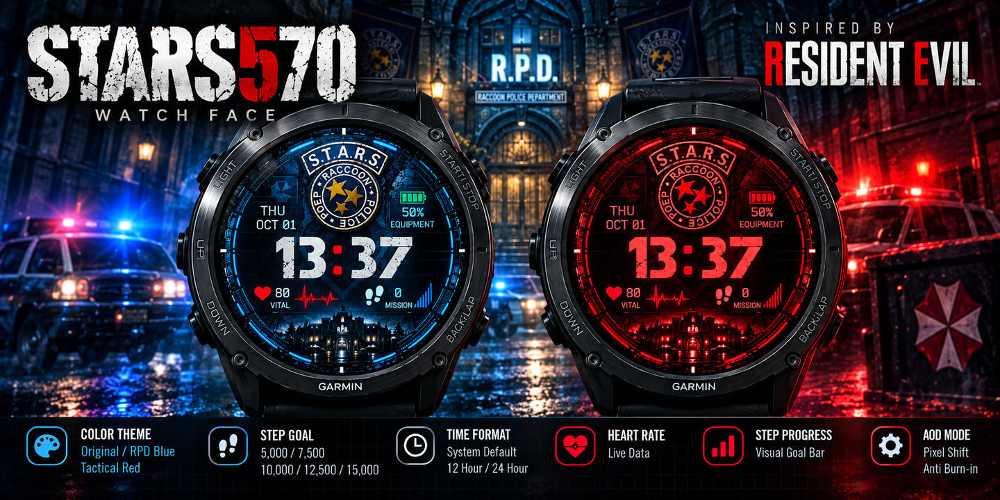
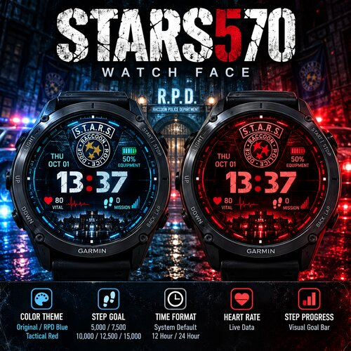

# STARS570

<p align="center">
  
</p>

<p align="center">
  <strong>A tactical-inspired digital watch face designed for Garmin Forerunner 570.</strong>
</p>

<p align="center">
  Tactical Interface • Custom Themes • Step Goals • Heart Rate • Always-On Display
</p>

---

## About STARS570

**STARS570** is a tactical-inspired digital watch face designed specifically for the **Garmin Forerunner 570**.

The watch face combines a clean digital interface with a military and survival-horror-inspired aesthetic, drawing visual inspiration from the classic **RPD / S.T.A.R.S.** style.

STARS570 is designed to keep essential information easy to read at a glance while maintaining a distinctive tactical appearance.

The project focuses on three core principles:

- **Essential Information**
- **Tactical Aesthetics**
- **Clean Digital Layout**

No unnecessary widgets. No excessive information.

Just the data you need — presented in a mission-ready interface.

---

## Preview

<p align="center">
  
</p>

STARS570 currently includes two primary visual themes:

**Original / RPD Blue**

The signature STARS570 appearance featuring a cool blue tactical interface.

**Tactical Red**

A darker red tactical interface featuring a subtle glow effect for a more aggressive mission-style appearance.

---

## Features

### Color Themes

Choose between multiple tactical-inspired visual styles.

- **Original / RPD Blue**
- **Tactical Red**

The selected theme changes the primary interface colors while maintaining the same core information layout.

Additional themes may be introduced in future versions.

---

### Step Goal

STARS570 allows you to configure your preferred daily step target.

Available goals:

| Goal  |  Steps |
| ----- | -----: |
| 5K    |  5,000 |
| 7.5K  |  7,500 |
| 10K   | 10,000 |
| 12.5K | 12,500 |
| 15K   | 15,000 |

Your selected target is used by the step progress system on the main watch face.

---

### Step Goal Progress

A visual progress bar displays your current progress toward your selected daily step goal.

The progress indicator follows the mission-style design language of STARS570, making daily activity progress easy to understand without adding unnecessary visual clutter.

---

### Heart Rate

Your current heart rate is displayed directly on the main watch face for quick access to essential activity information.

This keeps heart-rate information visible without requiring you to open another screen or widget.

---

### Steps

Your current daily step count is displayed directly on the watch face.

The step counter is integrated into the tactical mission-style interface so activity information remains visible while preserving the overall visual identity of STARS570.

---

### Time Format

STARS570 supports multiple time display modes:

- **System Default**
- **12 Hour**
- **24 Hour**

The selected format is applied consistently across both the main watch face and the Always-On Display.

---

## Always-On Display

STARS570 includes an Always-On Display designed with AMOLED readability and screen protection in mind.

AOD features include:

- Simplified low-power interface
- Tactical Red AOD appearance
- Reduced visual elements
- Pixel-shift behavior
- Consistent 12 / 24-hour formatting
- Burn-in risk reduction considerations

The AOD layout intentionally displays less information than the full watch face to reduce the number of continuously illuminated pixels.

Pixel shifting also slightly changes the position of displayed elements over time to help reduce prolonged static pixel usage.

> Always-On Display behavior and availability may depend on Garmin device settings and system power-management behavior.

---

## Design Philosophy

STARS570 is designed around three main principles.

### Essential Information

Important information should be immediately visible.

The interface prioritizes:

- Time
- Date
- Heart rate
- Steps
- Step goal progress

without overcrowding the display.

### Tactical Identity

The visual language is influenced by tactical equipment interfaces and mission-oriented displays.

The design uses:

- Structured information blocks
- Tactical-style typography
- Mission-inspired indicators
- High-contrast colors
- Restrained visual effects
- Clear information hierarchy

### Clean Digital Layout

Every element on the screen has a purpose.

STARS570 avoids excessive complications and unnecessary information in favor of a focused digital interface optimized for quick readability.

---

## Designed for Garmin Forerunner 570

STARS570 is designed specifically around the **Garmin Forerunner 570** experience.

The interface has been developed with the device's display characteristics in mind, including:

- Screen dimensions
- Information density
- Typography
- Element positioning
- AMOLED display behavior
- Always-On Display
- Readability
- Power considerations

Rather than using a generic watch-face layout, STARS570 is designed around the Forerunner 570 as its primary target device.

Support for additional Garmin devices may be considered in future versions.

---

## Customization

Current customization options include:

| Setting           | Available Options                 |
| ----------------- | --------------------------------- |
| Color Theme       | Original / RPD Blue, Tactical Red |
| Step Goal         | 5K, 7.5K, 10K, 12.5K, 15K         |
| Time Format       | System Default, 12 Hour, 24 Hour  |
| Heart Rate        | Live display                      |
| Step Progress     | Visual goal indicator             |
| Always-On Display | Supported                         |
| AOD Pixel Shift   | Supported                         |

More customization options may be added in future releases.

---

## Compatibility

### Primary Target

**Garmin Forerunner 570**

STARS570 is currently designed and optimized specifically for the Garmin Forerunner 570.

Compatibility with other Garmin devices is not guaranteed unless explicitly listed in a future release.

---

## Installation

### Garmin Connect IQ

A public release may be distributed through the Garmin Connect IQ ecosystem.

**Connect IQ Store:** Coming Soon

---

### Development Build

To build STARS570 locally, you will need a Garmin Connect IQ development environment.

Typical requirements include:

- Garmin Connect IQ SDK
- Monkey C development tools
- Visual Studio Code or another compatible development environment
- Garmin Connect IQ extension/tooling
- Garmin Forerunner 570 simulator or compatible physical device

Clone the repository:

```bash
git clone https://github.com/blinkz333/STARS570.git
```

Enter the project directory:

```bash
cd STARS570
```

Open the project in your Connect IQ development environment and select the appropriate Forerunner 570 device profile before building or running the application.

---

## Project Structure

The repository is organized around a standard Garmin Connect IQ project structure.

```text
STARS570/
│
├── assets/
│   ├── stars570-banner.png
│   └── stars570-preview.png
│
├── source/
│   ├── STARS570App.mc
│   ├── STARS570View.mc
│   └── ...
│
├── resources/
│   ├── drawables/
│   ├── fonts/
│   ├── layouts/
│   ├── settings/
│   └── strings/
│
├── manifest.xml
├── monkey.jungle
├── README.md
└── LICENSE
```

The exact project structure may change as development continues.

---

## Development

STARS570 is developed using the **Garmin Connect IQ** platform and **Monkey C**.

Development focuses on maintaining a balance between:

- Visual quality
- Readability
- Performance
- Memory usage
- Battery considerations
- Always-On Display behavior

Because smartwatch applications operate under tighter hardware and power constraints than traditional applications, interface elements are designed with efficiency in mind.

---

## Roadmap

STARS570 will continue to evolve with improvements focused on customization, performance, and usability.

Potential future improvements include:

- Additional color themes
- Additional configurable data fields
- More activity information
- Expanded watch-face settings
- Additional AOD customization
- UI refinements
- Performance optimization
- Battery optimization
- Additional Garmin device support

Features listed in the roadmap are not guaranteed and may change depending on development progress, device capabilities, and Connect IQ limitations.

---

## Feedback & Bug Reports

Feedback, suggestions, and bug reports are welcome.

If you encounter an issue, please open a GitHub Issue and include as much information as possible.

Useful information includes:

- Garmin watch model
- STARS570 version
- Description of the issue
- Steps to reproduce
- Expected behavior
- Actual behavior
- Screenshot, if applicable

This information makes troubleshooting significantly easier.

---

## Contributing

STARS570 is currently maintained as a focused watch-face project.

Suggestions and bug reports are welcome through GitHub Issues.

If contribution support is expanded in the future, additional contribution guidelines may be provided.

---

## Disclaimer

**STARS570 is an independent fan-made project.**

This project is not affiliated with, endorsed by, sponsored by, or officially connected with **Garmin**, **Capcom**, or any other third-party rights holder.

Garmin, Forerunner, Connect IQ, Resident Evil, R.P.D., S.T.A.R.S., and other respective names, logos, characters, and trademarks are the property of their respective owners.

References to third-party properties are used only to describe the visual inspiration and aesthetic direction of this independent project.

---

## License

Copyright © 2026 STARS570.

Source code and original project assets are subject to the terms specified in the repository's `LICENSE` file.

Please review the license before redistributing, modifying, publishing, or creating derivative versions of this project.

---

<p align="center">
  <strong>STARS570</strong>
</p>

<p align="center">
  Mission-ready information. Right on your wrist.
</p>

<p align="center">
  Designed for Garmin Forerunner 570.
</p>
